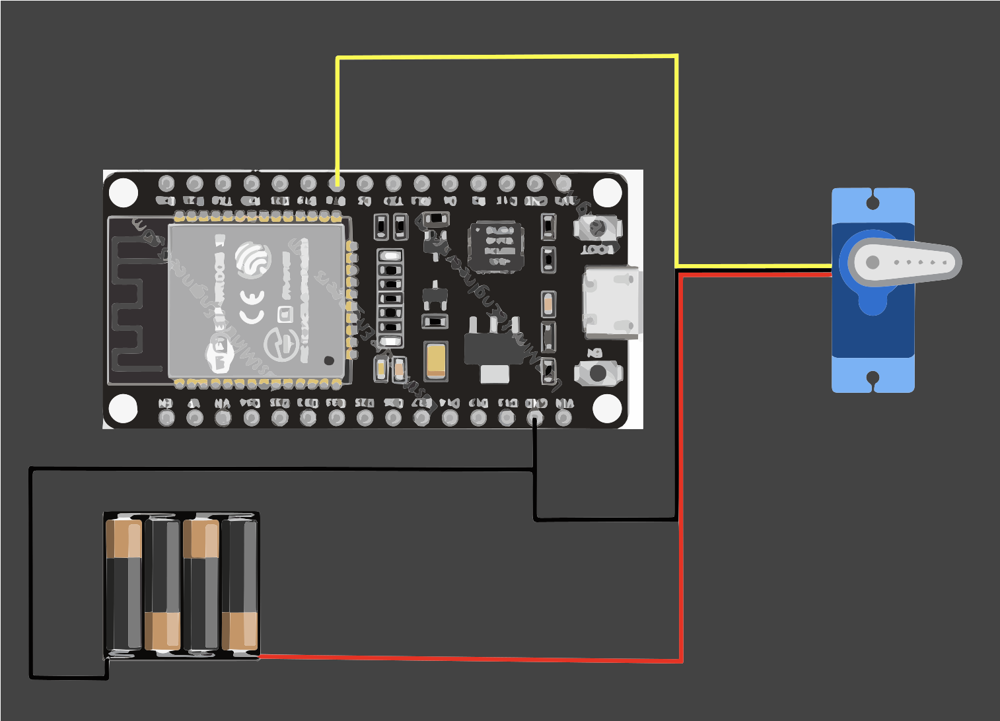
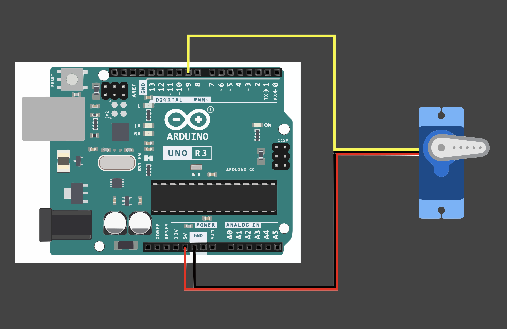

# Automatic Arduino Pet Feeder
This project involves the development of an automated pet feeding system. Utilizing an Arduino microcontroller and a servo motor, the device dispenses pre-measured portions of food at scheduled intervals. The goal is to create a reliable, user-friendly solution that ensures consistent feeding times, supports pet health, and offers convenience for pet owners.


| **Engineer** | **School** | **Area of Interest** | **Grade** |
| Zachary S | Saratoga High School | Electrical Engineering | Incoming Senior|

# Modifications Milestone

<iframe width="560" height="315" src="https://www.youtube.com/embed/X7v8JUUDjqg?si=OB0PsUtb3qg2t7TQ" title="YouTube video player" frameborder="0" allow="accelerometer; autoplay; clipboard-write; encrypted-media; gyroscope; picture-in-picture; web-share" referrerpolicy="strict-origin-when-cross-origin" allowfullscreen></iframe>

I have expanded my project to include a website where users can change feeding times, feed, and check the last time food was dispensed through a Wi-Fi connection. I switched my Arduino to an ESP32, which has an additional feature of Bluetooth connection. I changed the majority of my code to be more editable, allowing for easy bug fixes and editing. When switching to an ESP32, it no longer has a 5V output but instead a 3.3V output, so I have to switch my servo to be powered by a battery pack.

Here is the schematic for the wiring:


# Final Milestone

<iframe width="560" height="315" src="https://www.youtube.com/embed/Er9wOi8vWgo?si=Dy5ZuS4dsCuHK4jM" title="YouTube video player" frameborder="0" allow="accelerometer; autoplay; clipboard-write; encrypted-media; gyroscope; picture-in-picture; web-share" referrerpolicy="strict-origin-when-cross-origin" allowfullscreen></iframe>

I have completed my pre-modifications auto pet feeder. For this milestone, my goal was simple: Assembly. This took a while. Originally, I had to wait a couple of days for the resources to arrive, then I got straight to work. Slowly, I attached pieces of wood until I had a completed body that could hold my bottle, Arduino, and servo (on a 3D-printed board). I faced a few challenges; however, they're important. Originally, I had the servo connected in the wrong direction, and I drilled too quickly, partially splitting the wood.

Here is the schematic for the body:


# Second Milestone

<iframe width="560" height="315" src="https://www.youtube.com/embed/8yCQyTd6C6A?si=BSUMwjBY3fnUcX5J" title="YouTube video player" frameborder="0" allow="accelerometer; autoplay; clipboard-write; encrypted-media; gyroscope; picture-in-picture; web-share" referrerpolicy="strict-origin-when-cross-origin" allowfullscreen></iframe>

I have successfully uploaded a pre-written program to my Arduino, which controls the servo motor as intended. So far, the development process has been more straightforward than I initially expected; I anticipated greater difficulty in assembling the components and getting the system operational. My servo motor connects to my Arduino in 3 locations: PWM Port #9, 5V, and Ground. PWM Port #9 sends code from the Arduino to the servo motor. 5V powers the whole machine, and Ground prevents the machine from overloading. One minor challenge I encountered was navigating the Arduino IDE, particularly in locating the Verify (Check) and Upload functions, which were not immediately intuitive. As I prepare for the next project milestone, my focus will be on constructing the physical housing for the feeder, which will complete the first functional prototype.

# First Milestone

<iframe width="560" height="315" src="https://www.youtube.com/embed/Kml1ljBbxgg?si=0Z-JtJnZRnDKTnNK" title="YouTube video player" frameborder="0" allow="accelerometer; autoplay; clipboard-write; encrypted-media; gyroscope; picture-in-picture; web-share" referrerpolicy="strict-origin-when-cross-origin" allowfullscreen></iframe>

My project utilizes an Arduino microcontroller in conjunction with a servo motor to create an automated mechanism that dispenses food after a predetermined interval. I have developed two schematics: one outlining the overall design and functional plan for the feeder, and another detailing the wiring connections between the Arduino and the servo. The hardware components have been correctly assembled, with the servo successfully interfaced with the Arduino. The next phase of the project involves programming the motor to execute the timed feeding function, followed by constructing the physical enclosure for the feeder system.

Here is the schematic for my Arduino and Servo:


# Starter Project Milestone

<iframe width="560" height="315" src="https://www.youtube.com/embed/h47uthwTUgk?si=v59A54_-x_ONo7Ym" title="YouTube video player" frameborder="0" allow="accelerometer; autoplay; clipboard-write; encrypted-media; gyroscope; picture-in-picture; web-share" referrerpolicy="strict-origin-when-cross-origin" allowfullscreen></iframe>

For my starter project, I soldered together multiple parts of a retro arcade console and controller. I soldered things such as matrix LEDs, buzzers, buttons, and switches following a step-by-step guide. The project allowed me to learn how to solder and connect wires.  


# Code

```c++
#include <ESP32Servo.h>             // Library for controlling servos on ESP32
#include "AdafruitIO_WiFi.h"        // Adafruit IO library for IoT connectivity
#include "WiFi.h"                   // ESP32 WiFi library
#include "time.h"                   // Library for handling time functions

// --- WiFi & Adafruit IO Credentials ---
#define WIFI_SSID "j10-wifi"
#define WIFI_PASS "penguins"
#define IO_USERNAME  "zstanis"
#define IO_KEY       "aio key"

// Initialize Adafruit IO WiFi object with credentials
AdafruitIO_WiFi io(IO_USERNAME, IO_KEY, WIFI_SSID, WIFI_PASS);

// --- Define Feeds for Adafruit IO ---
AdafruitIO_Feed *LastFeed = io.feed("LastFeed");               // Feed to store timestamp of last dispense
AdafruitIO_Feed *delayFeed = io.feed("delay-time");            // Feed to receive delay time between dispenses
AdafruitIO_Feed *trigger = io.feed("trigger-servo");           // Feed to manually trigger dispense
AdafruitIO_Feed *ultrasonicFeed = io.feed("ultrasonic-distance");  // Feed to send ultrasonic distance data

// --- Servo Setup ---
Servo myservo;
int servoPin = 18;                      // GPIO pin for servo
int pos = 0;                            // Position for servo
int userDelaySeconds = 0;              // Delay between dispenses in seconds

// --- Serial Input Handling ---
String inputString = "";               // Buffer for incoming serial input
bool inputComplete = false;           // Flag for complete input line

// --- Non-blocking delay logic ---
unsigned long delayStartMillis = 0;    // Timestamp when delay started
bool waitingForDelay = false;          // Flag indicating delay is in progress
bool readyToDispense = false;          // Flag indicating it's time to dispense

// --- Ultrasonic Sensor Pins ---
#define trigPin 4
#define echoPin 2

unsigned long lastUltrasonicSend = 0;               // Timestamp of last ultrasonic data send
const unsigned long ultrasonicInterval = 10000;     // Interval for sending ultrasonic data (10 seconds)

// --- Handle delay-time updates from Adafruit IO ---
void handleDelay(AdafruitIO_Data *data) {
  int receivedDelay = data->toInt();
  if (receivedDelay > 0 && receivedDelay <= 600) {
    userDelaySeconds = receivedDelay;
    Serial.print("Updated delay from Adafruit IO: ");
    Serial.print(userDelaySeconds);
    Serial.println(" seconds");
    startDelayCountdown();  // Restart timer
  } else {
    Serial.println("Invalid delay received from Adafruit IO");
  }
}

// --- Handle manual trigger from Adafruit IO ---
void handleTrigger(AdafruitIO_Data *data) {
  if (data->toInt() == 1) {
    Serial.println("Manual trigger received.");
    dispense();
    startDelayCountdown();  // Restart cooldown timer
  }
}

// --- Setup Function ---
void setup() {
  Serial.begin(115200);                // Start serial communication
  while (!Serial);                     // Wait for serial monitor to connect (for native USB)
  
  Serial.print("Connecting to Adafruit IO");
  io.connect();                        // Connect to Adafruit IO

  // Set up feed handlers
  delayFeed->onMessage(handleDelay);
  trigger->onMessage(handleTrigger);

  // Wait for connection to Adafruit IO
  while (io.status() < AIO_CONNECTED) {
    Serial.print(".");
    delay(500);
  }

  Serial.println("\nConnected to Adafruit IO");

  delayFeed->get();  // Fetch initial delay value from Adafruit IO

  // Setup the servo PWM on available ESP32 timers
  ESP32PWM::allocateTimer(0);
  ESP32PWM::allocateTimer(1);
  ESP32PWM::allocateTimer(2);
  ESP32PWM::allocateTimer(3);
  myservo.setPeriodHertz(50);             // Set standard 50Hz PWM for servo
  myservo.attach(servoPin, 1000, 2000);    // Attach servo with min/max pulse widths

  // Setup time synchronization using NTP
  configTime(-7 * 3600, 0, "pool.ntp.org", "time.nist.gov");
  Serial.println("Waiting for NTP time sync...");
  time_t now = time(nullptr);
  while (now < 8 * 3600 * 2) {             // Wait until valid time is received
    delay(500);
    Serial.print(".");
    now = time(nullptr);
  }
  Serial.println("\nTime synchronized!");

  // Setup ultrasonic sensor pins
  pinMode(trigPin, OUTPUT);
  pinMode(echoPin, INPUT);

  startDelayCountdown();  // Start initial wait timer
}

// --- Main Loop ---
void loop() {
  io.run();               // Handle Adafruit IO events
  readSerialInput();      // Check for input from Serial monitor

  // Check if it's time to dispense based on delay
  if (waitingForDelay && millis() - delayStartMillis >= userDelaySeconds * 1000UL) {
    waitingForDelay = false;
    readyToDispense = true;
  }

  // Dispense if the timer expired
  if (readyToDispense) {
    dispense();
    readyToDispense = false;
    startDelayCountdown();  // Restart delay
  }

  // Send ultrasonic reading every 10 seconds
  if (millis() - lastUltrasonicSend >= ultrasonicInterval) {
    sendUltrasonicDistance();
    lastUltrasonicSend = millis();
  }
}

// --- Dispense routine: moves servo and logs timestamp to Adafruit IO ---
void dispense() {
  // Get current time
  time_t now = time(nullptr);
  struct tm timeinfo;
  localtime_r(&now, &timeinfo);
  char timeString[30];
  strftime(timeString, sizeof(timeString), "%Y-%m-%d %H:%M:%S", &timeinfo);

  Serial.print("Sending time: ");
  Serial.println(timeString);
  LastFeed->save(timeString);  // Send timestamp to feed

  // Rotate servo 180 to 0
  for (pos = 180; pos >= 0; pos -= 1) {
    myservo.write(pos);
    delay(15);  // Smooth movement
  }

  // Rotate servo back 0 to 180
  for (pos = 0; pos <= 180; pos += 1) {
    myservo.write(pos);
    delay(15);
  }
}

// --- Read distance from ultrasonic sensor and send result to Adafruit IO ---
void sendUltrasonicDistance() {
  digitalWrite(trigPin, LOW);
  delayMicroseconds(2);
  digitalWrite(trigPin, HIGH);
  delayMicroseconds(10);
  digitalWrite(trigPin, LOW);

  long duration = pulseIn(echoPin, HIGH, 30000);  // Measure echo time (max 30ms)
  int distance = duration * 0.034 / 2;            // Convert to cm

  Serial.print("Measured distance: ");
  Serial.print(distance);
  Serial.println(" cm");

  // Send distance category to feed (1 = close, 2 = far)
  if (distance > 12) {
    ultrasonicFeed->save(2);  // Far
  } else {
    ultrasonicFeed->save(1);  // Close
  }
}

// --- Start or restart the countdown timer ---
void startDelayCountdown() {
  delayStartMillis = millis();
  waitingForDelay = true;
}

// --- Handle user input from Serial monitor for delay updates ---
void readSerialInput() {
  while (Serial.available()) {
    char inChar = (char)Serial.read();
    if (inChar == '\n') {
      inputComplete = true;
      break;
    } else {
      inputString += inChar;
    }
  }

  // When complete input is received, process it
  if (inputComplete) {
    int val = inputString.toInt();
    if (val > 0) {
      userDelaySeconds = val;
      Serial.print("Updated delay via Serial: ");
      Serial.print(userDelaySeconds);
      Serial.println(" seconds");
      startDelayCountdown();  // Restart delay
    } else {
      Serial.println("Invalid input. Please enter a positive number.");
    }
    inputString = "";
    inputComplete = false;
  }
}

```

# Bill of Materials

| **Part** | **Note** | **Price** | **Link** |
|:--:|:--:|:--:|:--:|
| ELEGOO UNO R3 Board | Knowledge System | $13.99 | <a href="https://www.amazon.com/ELEGOO-Board-ATmega328P-ATMEGA16U2-Compliant/dp/B01EWOE0UU/ref=asc_df_B01EWOE0UU?mcid=3c20e862567d3232bda82cbee4dcb2bc&hvocijid=14813818644327468140-B01EWOE0UU-&hvexpln=73&tag=hyprod-20&linkCode=df0&hvadid=721245378154&hvpos=&hvnetw=g&hvrand=14813818644327468140&hvpone=&hvptwo=&hvqmt=&hvdev=c&hvdvcmdl=&hvlocint=&hvlocphy=9032183&hvtargid=pla-2281435179498&psc=1"> Link </a> |
| ESP32 | Knowledge System with Bluetooth capabilites | $8.99 | <a href="https://www.amazon.com/ESP-WROOM-32-Development-Dual-Mode-Microcontroller-Integrated/dp/B07WCG1PLV/ref=asc_df_B07WCG1PLV?mcid=b7c3e4a5e22b38a790d9718027032887&hvocijid=18275521607354424470-B07WCG1PLV-&hvexpln=73&tag=hyprod-20&linkCode=df0&hvadid=721245378154&hvpos=&hvnetw=g&hvrand=18275521607354424470&hvpone=&hvptwo=&hvqmt=&hvdev=c&hvdvcmdl=&hvlocint=&hvlocphy=9032171&hvtargid=pla-2281435178138&th=1"> Link </a> |
| AA Battery Case | Power case | $7.49 | <a href="https://www.amazon.com/dp/B07L9M6VZK/ref=sspa_dk_detail_0?psc=1&pd_rd_i=B07L9M6VZK&pd_rd_w=gBuAm&content-id=amzn1.sym.bbb3fb5e-28ad-4062-a3ba-1f7b9f2e4371&pf_rd_p=bbb3fb5e-28ad-4062-a3ba-1f7b9f2e4371&pf_rd_r=2BKTAQJ483T9PX9JF75Q&pd_rd_wg=z69RZ&pd_rd_r=63807f12-675c-4552-aa69-0fa8b13aa6ef&s=electronics&sp_csd=d2lkZ2V0TmFtZT1zcF9kZXRhaWxfdGhlbWF0aWM"> Link </a> | 
| AA Batteries | Power | $21.92 | <a href="https://www.amazon.com/Duracell-Coppertop-Batteries-Ingredients-Long-lasting/dp/B0B1DF9NVJ/ref=sr_1_2_sspa?crid=25893ONGDKLQC&dib=eyJ2IjoiMSJ9.JNmFq4jzf69FrLRfMusz_CDAzZAEcfi6bzLtk30gr8X-JgVbPqU__O8YJbph5Nlwr6AqcbPp3qEvoejidqyA9axMz6jqzPFA1O8ahK9v2s4haxcud2fxkqPk_ERt-cmd1v_l5bYLTXuudlNQ0KNkp6ZIFEtX-80vEWpQMp1h2m7-xwQ7zJYYeU2MLAQ2_nmL9RSTG64fN3slx1jiEya5qfJmPPRMAuOmApJDMsKgkjFXDcw4XOpZawuP37XBOmT9hl5p2zwRLXvrRaEsiqYZPsrdnm1tgNdaCD9jrclKaWs.IPpMQczTwgr69jOR7_XprR6RaTkYPCmFGi_PExj_ZKw&dib_tag=se&keywords=aa&qid=1753129557&s=electronics&sprefix=a%2Celectronics%2C220&sr=1-2-spons&sp_csd=d2lkZ2V0TmFtZT1zcF9hdGY&th=1"> Link </a> | 
| Bread Board | Connect Grounds | $5.99 | <a href="https://www.amazon.com/DEYUE-Solderless-Prototype-Breadboard-Points/dp/B07NVWR495/ref=sr_1_7?crid=31DXOTG8PEZAV&dib=eyJ2IjoiMSJ9.aPMmF7DvOPBE-tfBu2vmUie8hSgXCBThtl8-kiWvP-26vieaLgKDVQvaF8hu15SZ2rJKXB9-Vm2YOlp0hftRuEmBY53e6JyHvaST9rPnuAxZcjpoiS5ymca77AZFz-qRXNnPK9ev-w_UyaEYyE4cIefRLyox_rOZKngYhA9X7WQ-0TkdlcgDXtr5f105h9NpvwjbV4ZGXSGvGgQEixUDiwuRZfJ-ZPZ3HZtf6643ix4KaCK9eYJ7yEZzw_YZkAqUj-a40tpVHUaauG4z-wkGlmGqtKxwpmCM1ij-_pFURv4.t72knPytjInl-Eme8AsHViCuhNNenGXRUAaTdRcmW9Y&dib_tag=se&keywords=bread%2Bboard&qid=1753129617&s=electronics&sprefix=bread%2Bboar%2Celectronics%2C146&sr=1-7&th=1"> Link </a> |
| Micro Servo Motor | Motor | $3.95 | <a href="https://www.pishop.us/product/sg90-180-degrees-9g-micro-servo-motor-tower-pro/?srsltid=AfmBOopBU3qoo6JMPLqnKSsB_kBYvWlNnjVJRjSDOiPPOsoE6C3P-Kll"> Link </a> |
| Breadboard Jumper Wires | Connecting Arduino to Servo | $7.49 | <a href="https://www.amazon.com/EDGELEC-Breadboard-Multicolored-1pin-1pin-Connector/dp/B07GD431C1?source=ps-sl-shoppingads-lpcontext&ref_=fplfs&smid=A3S1JN3RP90N86&gQT=1&th=1"> Link </a> |
| Cardboard | Food dispensing lid & Servo platform | $34.20 | <a href="https://www.amazon.com/BOX-USA-BHD888DW-Double-Boxes/dp/B01D2745AS?source=ps-sl-shoppingads-lpcontext&ref_=fplfs&smid=ATVPDKIKX0DER&gQT=1&th=1"> Link </a> |
| Bottle | Food Storage | $14.99 | <a href="https://www.amazon.com/Plastic-Bottles-Evident-MT-Products/dp/B0DV9KJNQ8/ref=sr_1_56?crid=3IE1TYC64QSNV&dib=eyJ2IjoiMSJ9.Z2YPjEa4clS-jR9nWaJfQh1PcLc-r0epd42-jKv6AbFuHgM9oFKa_gfJEFG6ExS2IUDIq56qOaNplgxsXvxG6X2PREHEsYrltsGPL137eyB87JjW1ChnRAFvkEOJCtl3VOW7mEf0PcYo330qOX3gFtEvZTQ6161G9XN_glbNQIXr7ixrhTIhkMTXw4fJSH8PawYrWRGr-61ZXep0IZQ7gFw5rI26Dhb573TSoe004UABUIEZ2WLYb0gaV26LDLwCmxgSJ2T5E_n2juRmcZhj45KPvig9FtuuiSXQmEjUlIw.et3zReqWTUa92pLCzfwuu976dLGY44iiEEx4fbXSutQ&dib_tag=se&keywords=gallon%2Bbottle&qid=1752010065&sprefix=gallonbottle%2Caps%2C130&sr=8-56&th=1"> Link </a> |
| USB Cable | Powering device | $6.39 | <a href="https://www.amazon.com/Amazon-Basics-External-Gold-Plated-Connectors/dp/B00NH13DV2/ref=asc_df_B00NH13DV2?mcid=7b0ef2f745a03442894b878cac036b6e&hvocijid=17925455797167343296-B00NH13DV2-&hvexpln=73&tag=hyprod-20&linkCode=df0&hvadid=721245378154&hvpos=&hvnetw=g&hvrand=17925455797167343296&hvpone=&hvptwo=&hvqmt=&hvdev=c&hvdvcmdl=&hvlocint=&hvlocphy=9032183&hvtargid=pla-2281435179778&th=1"> Link </a> |
| Wood | Holds Food Storage | $7.64 | <a href="https://www.amazon.com/dp/B0D73D2RQT?ref=fed_asin_title&th=1"> Link </a> |
| Wood Boards | Holds Arduino | $7.99 | <a href="https://www.amazon.com/Pack-Basswood-Sheets-Crafts-Architectural/dp/B0CZDBZ6WQ/ref=sxin_15_pa_sp_search_thematic_sspa?content-id=amzn1.sym.2da95b6c-f59a-4699-bc43-d0ff036c6388%3Aamzn1.sym.2da95b6c-f59a-4699-bc43-d0ff036c6388&crid=3HO8820AZ1VFR&cv_ct_cx=flat%2Bwood&keywords=flat%2Bwood&pd_rd_i=B0DGPYSXTP&pd_rd_r=488bedc4-b63b-4788-a78a-373ff9f5d17e&pd_rd_w=EhHIS&pd_rd_wg=eiBXP&pf_rd_p=2da95b6c-f59a-4699-bc43-d0ff036c6388&pf_rd_r=W4MCFDZVWVR5D0YF11ZN&qid=1752617818&sbo=RZvfv%2F%2FHxDF%2BO5021pAnSA%3D%3D&sprefix=flat%2Bwo%2Caps%2C163&sr=1-4-6024b2a3-78e4-4fed-8fed-e1613be3bcce-spons&sp_csd=d2lkZ2V0TmFtZT1zcF9zZWFyY2hfdGhlbWF0aWM&th=1"> Link </a> | 
| Screws | Holds wood together | $9.99 | <a href="https://www.amazon.com/HanTof-Phillips-Self-Tapping-Recessed-Assortment/dp/B09CPHWX7P/ref=sr_1_9?crid=2XDJGVXZUSW8A&dib=eyJ2IjoiMSJ9.hFNKFLF0EAmvspwRiW_CJqKzN3qg3tZ90VLFsSRKfUWzBcRw8Nvhe-Xjqdh-cINwffssnx06WIBjAX9Iwea0QCNhy7il5frfWjtl7koJS6ZM1f9HRNS4enyhRQfdimqhusC3vplPssYaF9Jz76lrk9_nM1ENhSdLUvSxo2V8EYn4KtI3cDSFQphh3i13Y36JDAsNGvXbapvhIplh70-vRxjedfWWV3sCrG6TxJZJ-QQ.xhse6FbYE0MQyP9AjfpBazhEgx1Kar6zM342jK9C3IA&dib_tag=se&keywords=wood%2Bscrews%2Bmillimeters&qid=1752618089&sprefix=wood%2Bscrews%2Bmillimeter%2Caps%2C138&sr=8-9&th=1"> Link </a> |
| Hot Glue Sticks | Glue stuff together | $7.68 | <a href="https://www.amazon.com/Ad-Tech-High-Temp-Sticks-5-W229-34/dp/B00DOAVCN2/ref=sr_1_8?crid=3RKBPEX02OO1E&dib=eyJ2IjoiMSJ9.ULaVt8damRgCYq-aNT559_LfQBuC_0Egs_nmFmLvDsXBeKds2ihI0oyrDqioiio_88OlwFxxXpwmWofB_-2lBybBSwaeqMaO4OzNlqtaCjf4bXrUl2aQz5E3UdTul8J8zjA2RfJlVe6v4mQYGeMzt99o57uOGGmvu4EzLBCypnSjwGS4ZIoTCtfbMUk8tZl6b1NFT6yhTG1VjnB6OwiojlJLs2BLerFAVqkzfxdhR_WTALRQflDTqTv2ajpZGlqA5MuSzTvZDl6VeTJOiAPCo8UeWvlydI2QEaTSC4kiJw0.Y0gski1MFFkOvuyLCQcF4MD9a6OJOOwxjrRgUYyhgu0&dib_tag=se&keywords=hot%2Bglue%2Bsticks&qid=1752618330&sprefix=hot%2Bglue%2Bstick%2Caps%2C161&sr=8-8&th=1"> Link </a> |

# Tools

| **Tool** | **Price** | **Link** |
| Box Cutter | $10.39 | <a href="https://www.amazon.com/Retractable-Cardboard-Package-Scraper-Packages/dp/B07YMPQJK7/ref=asc_df_B07YMPQJK7?mcid=7bde0af999933ca19ad4bed2c8c70d5a&hvocijid=4749166825711708819-B07YMPQJK7-&hvexpln=73&tag=hyprod-20&linkCode=df0&hvadid=721245378154&hvpos=&hvnetw=g&hvrand=4749166825711708819&hvpone=&hvptwo=&hvqmt=&hvdev=c&hvdvcmdl=&hvlocint=&hvlocphy=9032183&hvtargid=pla-2281435179098&th=1"> Link </a> |
| Ruler | $2.99 | <a href="https://www.amazon.com/Plastic-Rulers-School-Assorted-Colors/dp/B0C1YXFP99/ref=asc_df_B0C1YXFP99?mcid=c61bb3da5a783aa0adfb36d028c553ff&hvocijid=16395250037265102296-B0C1YXFP99-&hvexpln=73&tag=hyprod-20&linkCode=df0&hvadid=721245378154&hvpos=&hvnetw=g&hvrand=16395250037265102296&hvpone=&hvptwo=&hvqmt=&hvdev=c&hvdvcmdl=&hvlocint=&hvlocphy=9032183&hvtargid=pla-2281435178858&th=1"> Link </a> |
| Drill |  $107.00 | <a href="https://www.amazon.com/BOSCH-PS31-2A-Two-Speed-Driver-Batteries/dp/B003BEE2LU/ref=sr_1_1_sspa?crid=1UPOPBAV6EAF7&dib=eyJ2IjoiMSJ9.gxAfO5xViGBxrkc8dVPEQOLcmInO0Or7UEOx4B6eJ-MRgZkgvkC0ofuPIu93yR4As1DDElfiKFqGJX17g77DxDbOsY27F-SLK0onu80MJPRnM3M4KN6vzhgcKtAxaCojFBU4M2soK7g88tx5x0_3Q-Sn4TUc72ByRpkg59ZWObFRXx0Cxw2W41NPzwrVhlWpVK3FVVoG26D7SmVBojCq9JQZYh0GIJpYx495OPgBgPtJBbfM1iboiTkhuz4S2eztoWBtQ_ZbsX4b6yOCbQXh3TX-SelUFPYCCjMnGJ0sfas.WREaN4gtlRF3R9ajeet0XXxNW2IbLyu5xnxhiUzlylg&dib_tag=se&keywords=drill&qid=1752617963&s=home-garden&sprefix=dril%2Cgarden%2C185&sr=1-1-spons&sp_csd=d2lkZ2V0TmFtZT1zcF9hdGY&th=1"> Link </a> |
| Hand Saw | $22.95 | <a href="https://www.amazon.com/DNA-MOTORING-Bi-Ground-Universal-TOOLS-00589/dp/B0DHKDCYTG/ref=sr_1_6?crid=GTGV8WS4ZY2K&dib=eyJ2IjoiMSJ9.bMZcXjVWu1gfeR4v_ZbRwdcoQSHpAESJIrUaoPtte-OLnCJyNDesad2zSlBrUVbGWsYbMhFN8-bojc9JLrlXydGj48xkXfYYPMzX3MdQmdKP1jOgTLoF6q2OQwmA5BvGClYdM4M313PEnASF1I7eck4GjUu7xg0u05zFfavPFhCafb6KgNe-PxtmsBUIhsKwGKhEUizr7S5Wxyxx0TqOWY0wY3ldI3KlEF6Ul242mA_rEkXd7XFuRiZVBZJKJCPlo6pFS2ej6dUrf7MmXLJUlBwPrYV9T0fakM6shRQtGzI.WkjYPGdPrUp2OAHQs2nP30anJzPubhxIGJB2i8Jlr-A&dib_tag=se&keywords=handsaw&qid=1752618006&s=home-garden&sprefix=handsaw%2Cgarden%2C150&sr=1-6&th=1"> Link </a> |
| Hot Glue Gun | $8.99 | <a href="https://www.amazon.com/Krightlink-Sticks-School-Crafts-Repairs/dp/B0BC878ZRG/ref=sr_1_1_sspa?crid=2X8BCSS6DC05J&dib=eyJ2IjoiMSJ9.rmkAqlNRv8pqMmb3ec-MNPaYTH5ZMVjsp6q0vu8TroHlNmVGScHImaqUsi9P4wKI0XIcby7MaMfWug14-fagODu4y-y6Gn66kz1dVNa8UEqwTcyNpXe2HnEBjd48TTNvQaVjXssnPIBMLpI281K3nRrId0oD3Iu5bffWBTWHVBZ-o185mtk3rkOZh69OodjTLfQ9DqDuCXRbVMsvX5T96C9OvteEzlWVDBHOCTBBusim2vrhPe4tEvj_BDrF8urwRP6SMCCVfIbl8wcoEzZGpXc9amTYLi0KZnNBsSdIE8o.JIPqRLj8YPcrYS4FPQ-zoupp4GcDDHqoWxEo2RZ8muU&dib_tag=se&keywords=hot%2Bglue%2Bgun&qid=1752618285&sprefix=hot%2Bglue%2Bgu%2Caps%2C177&sr=8-1-spons&sp_csd=d2lkZ2V0TmFtZT1zcF9hdGY&th=1"> Link </a> |

# Additional Resources

A 3D printer is needed to print the holder of the servo that has a hole for the water bottle.
A Computer is needed to code and power the project.

