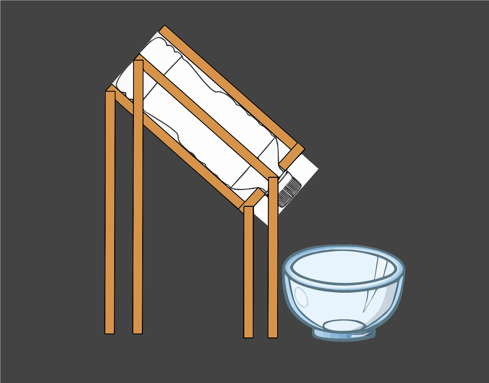

# Automatic Arduino Pet Feeder
This project involves the development of an automated pet feeding system. Utilizing an Arduino microcontroller and a servo motor, the device dispenses pre-measured portions of food at scheduled intervals. The goal is to create a reliable, user-friendly solution that ensures consistent feeding times, supports pet health, and offers convenience for pet owners.

<!--- You should comment out all portions of your portfolio that you have not completed yet, as well as any instructions: -->
<!--- ```HTML  -->
<!--- This is an HTML comment in Markdown -->
<!--- Anything between these symbols will not render on the published site -->

| **Engineer** | **School** | **Area of Interest** | **Grade** |
|:--:|:--:|:--:|:--:|
| Zachary S | Saratoga High School | Electrical Engineering | Incoming Senior
<!---  
**Replace the BlueStamp logo below with an image of yourself and your completed project. Follow the guide [here](https://tomcam.github.io/least-github-pages/adding-images-github-pages-site.html) if you need help.**
-->

<!---  
# Final Milestone
<!---  
**Don't forget to replace the text below with the embedding for your milestone video. Go to Youtube, click Share -> Embed, and copy and paste the code to replace what's below.**
<!---  
<iframe width="560" height="315" src="https://www.youtube.com/embed/F7M7imOVGug" title="YouTube video player" frameborder="0" allow="accelerometer; autoplay; clipboard-write; encrypted-media; gyroscope; picture-in-picture; web-share" allowfullscreen></iframe>
<!---  
For your final milestone, explain the outcome of your project. Key details to include are:
- What you've accomplished since your previous milestone
- What your biggest challenges and triumphs were at BSE
- A summary of key topics you learned about
- What you hope to learn in the future after everything you've learned at BSE

# Second Milestone

<iframe width="560" height="315" src="https://www.youtube.com/embed/8yCQyTd6C6A?si=BSUMwjBY3fnUcX5J" title="YouTube video player" frameborder="0" allow="accelerometer; autoplay; clipboard-write; encrypted-media; gyroscope; picture-in-picture; web-share" referrerpolicy="strict-origin-when-cross-origin" allowfullscreen></iframe>

Summary:
- I have used a set program and downloaded it onto my Arduino, which can send it to my servo.
- I've been surprised by how simple my project has been so far. Going into this, I thought it would be much more challenging to put everything together and make it run.
- One interesting challenge I faced is that on the Arduino software, it is unclear of the location of the Check and Upload buttons.
- Before my next Milestone, I need to build the body of my project, finishing the first version of it.

# First Milestone

<iframe width="560" height="315" src="https://www.youtube.com/embed/Kml1ljBbxgg?si=0Z-JtJnZRnDKTnNK" title="YouTube video player" frameborder="0" allow="accelerometer; autoplay; clipboard-write; encrypted-media; gyroscope; picture-in-picture; web-share" referrerpolicy="strict-origin-when-cross-origin" allowfullscreen></iframe>

Summary:
- My project includes an Arduino and a Servo; they work together to create a moving motor that will release food after a set amount of time.   
- I have created 2 schematics, which entail my plan for my project and my wiring of the servo and Arduino.
- I have correctly connected my Arduino to my Servo.
- My current plan is to program my motor and then build the body of my project.

# Schematics 



# Code

```c++
#include <Servo.h>

#define FEED_INTERVAL   1   // minutes between feeding time

const byte servoPin = 9;      // pin used to command the servo motor
const int waitingTime = FEED_INTERVAL;

Servo servo;

volatile unsigned long sec;
const unsigned long feedInterval = (unsigned long) FEED_INTERVAL * (unsigned long) 5;  // expressed in seconds

/**
   Stop the food from flowing
*/
void feederClose() {
  servo.write(90);
  delay(175);
  servo.write(0);
}

/**
   release a ration of food
*/
void feederOpen() {
  servo.write(0);
  delay(175);
  servo.write(90);
}

// Interrupt is called once a millisecond,
SIGNAL(TIMER0_COMPA_vect)
{
  if (millis() % 1000 == 0) { // if a second has passed
    sec++;  // increment the seconds counter
    Serial.print("Second: ");
    Serial.print(sec);
    Serial.print(" of ");
    Serial.println(feedInterval);
  }
}

void setup() {
  Serial.begin(9600);
  OCR0A = 0xAF; // set the timer interrupt
  TIMSK0 |= _BV(OCIE0A);
  servo.attach(servoPin);
  Serial.println("System initialized");
}

void loop() {
  Serial.println("Waiting...");
  sec = 0;  // reset the counter
  while (feedInterval > sec);   // wait until the time interval is elapsed
  Serial.println("Feeding the pet :)");
  feederOpen();
  delay(300);
  feederClose();
}
```

# Bill of Materials

| **Part** | **Note** | **Price** | **Link** |
|:--:|:--:|:--:|:--:|
| ELEGOO UNO R3 Board | Knowledge System | $13.99 | <a href="https://www.amazon.com/ELEGOO-Board-ATmega328P-ATMEGA16U2-Compliant/dp/B01EWOE0UU/ref=asc_df_B01EWOE0UU?mcid=3c20e862567d3232bda82cbee4dcb2bc&hvocijid=14813818644327468140-B01EWOE0UU-&hvexpln=73&tag=hyprod-20&linkCode=df0&hvadid=721245378154&hvpos=&hvnetw=g&hvrand=14813818644327468140&hvpone=&hvptwo=&hvqmt=&hvdev=c&hvdvcmdl=&hvlocint=&hvlocphy=9032183&hvtargid=pla-2281435179498&psc=1"> Link </a> |
| Micro Servo Motor | Motor | $3.95 | <a href="https://www.pishop.us/product/sg90-180-degrees-9g-micro-servo-motor-tower-pro/?srsltid=AfmBOopBU3qoo6JMPLqnKSsB_kBYvWlNnjVJRjSDOiPPOsoE6C3P-Kll"> Link </a> |
| Breadboard Jumper Wires | Connecting Arduino to Servo | $7.49 | <a href="https://www.amazon.com/EDGELEC-Breadboard-Multicolored-1pin-1pin-Connector/dp/B07GD431C1?source=ps-sl-shoppingads-lpcontext&ref_=fplfs&smid=A3S1JN3RP90N86&gQT=1&th=1"> Link </a> |
| Cardboard | Food dispensing lid & Servo platform | $34.20 | <a href="https://www.amazon.com/BOX-USA-BHD888DW-Double-Boxes/dp/B01D2745AS?source=ps-sl-shoppingads-lpcontext&ref_=fplfs&smid=ATVPDKIKX0DER&gQT=1&th=1"> Link </a> |
| Bottle | Food Storage | $14.99 | <a href="https://www.amazon.com/Plastic-Bottles-Evident-MT-Products/dp/B0DV9KJNQ8/ref=sr_1_56?crid=3IE1TYC64QSNV&dib=eyJ2IjoiMSJ9.Z2YPjEa4clS-jR9nWaJfQh1PcLc-r0epd42-jKv6AbFuHgM9oFKa_gfJEFG6ExS2IUDIq56qOaNplgxsXvxG6X2PREHEsYrltsGPL137eyB87JjW1ChnRAFvkEOJCtl3VOW7mEf0PcYo330qOX3gFtEvZTQ6161G9XN_glbNQIXr7ixrhTIhkMTXw4fJSH8PawYrWRGr-61ZXep0IZQ7gFw5rI26Dhb573TSoe004UABUIEZ2WLYb0gaV26LDLwCmxgSJ2T5E_n2juRmcZhj45KPvig9FtuuiSXQmEjUlIw.et3zReqWTUa92pLCzfwuu976dLGY44iiEEx4fbXSutQ&dib_tag=se&keywords=gallon%2Bbottle&qid=1752010065&sprefix=gallonbottle%2Caps%2C130&sr=8-56&th=1"> Link </a> |
| USB Cable | Powering device | $6.39 | <a href="https://www.amazon.com/Amazon-Basics-External-Gold-Plated-Connectors/dp/B00NH13DV2/ref=asc_df_B00NH13DV2?mcid=7b0ef2f745a03442894b878cac036b6e&hvocijid=17925455797167343296-B00NH13DV2-&hvexpln=73&tag=hyprod-20&linkCode=df0&hvadid=721245378154&hvpos=&hvnetw=g&hvrand=17925455797167343296&hvpone=&hvptwo=&hvqmt=&hvdev=c&hvdvcmdl=&hvlocint=&hvlocphy=9032183&hvtargid=pla-2281435179778&th=1"> Link </a> |
| Wood | Holds Food Storage | $7.64 | <a href="https://www.amazon.com/dp/B0D73D2RQT?ref=fed_asin_title&th=1"> Link </a> |

# Tools

| **Tool** | **Price** | **Link** |
| Box Cutter | $10.39 | <a href="https://www.amazon.com/Retractable-Cardboard-Package-Scraper-Packages/dp/B07YMPQJK7/ref=asc_df_B07YMPQJK7?mcid=7bde0af999933ca19ad4bed2c8c70d5a&hvocijid=4749166825711708819-B07YMPQJK7-&hvexpln=73&tag=hyprod-20&linkCode=df0&hvadid=721245378154&hvpos=&hvnetw=g&hvrand=4749166825711708819&hvpone=&hvptwo=&hvqmt=&hvdev=c&hvdvcmdl=&hvlocint=&hvlocphy=9032183&hvtargid=pla-2281435179098&th=1"> Link </a> |
| Ruler | $2.99 | <a href="https://www.amazon.com/Plastic-Rulers-School-Assorted-Colors/dp/B0C1YXFP99/ref=asc_df_B0C1YXFP99?mcid=c61bb3da5a783aa0adfb36d028c553ff&hvocijid=16395250037265102296-B0C1YXFP99-&hvexpln=73&tag=hyprod-20&linkCode=df0&hvadid=721245378154&hvpos=&hvnetw=g&hvrand=16395250037265102296&hvpone=&hvptwo=&hvqmt=&hvdev=c&hvdvcmdl=&hvlocint=&hvlocphy=9032183&hvtargid=pla-2281435178858&th=1"> Link </a> |

